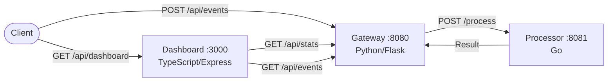
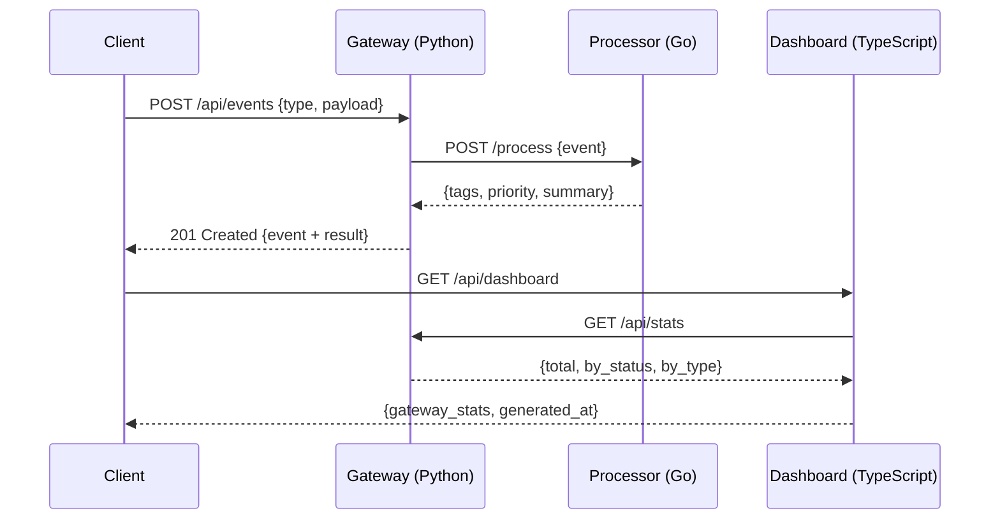

# StreamSync Hub

Real-time event processing and analytics platform built with a polyglot microservice architecture using Python, Go, and TypeScript.

## Overview

StreamSync Hub ingests, processes, and visualizes event streams in real time. It consists of three microservices:

- **Gateway** (Python/Flask) — API gateway that receives events, forwards them to the processor, and exposes query endpoints.
- **Processor** (Go) — High-performance event processor that classifies, tags, and prioritizes events.
- **Dashboard** (TypeScript/Express) — Analytics dashboard that aggregates data from the gateway and presents event timelines and statistics.

## Architecture





## Quick Start

### Prerequisites

- Docker and Docker Compose
- Or individually: Python 3.12+, Go 1.22+, Node.js 20+

### Using Docker Compose

```bash
cp .env.example .env
make up        # Start all services
make logs      # View logs
make down      # Stop all services
```

### Manual Setup

```bash
# Gateway (Python)
cd gateway
pip install -r requirements.txt
python app.py

# Processor (Go)
cd processor
go run main.go

# Dashboard (TypeScript)
cd dashboard
npm install
npm run build
npm start
```

## API Reference

### Gateway (port 8080)

| Method | Endpoint | Description |
|--------|----------|-------------|
| GET | `/health` | Health check |
| POST | `/api/events` | Create a new event |
| GET | `/api/events` | List events (optional `?type=` filter) |
| GET | `/api/events/:id` | Get event by ID |
| GET | `/api/stats` | Get aggregated statistics |

#### Create Event

```bash
curl -X POST http://localhost:8080/api/events \
  -H "Content-Type: application/json" \
  -d '{"type": "user.signup", "payload": {"user": "alice"}}'
```

Response:

```json
{
  "id": "550e8400-e29b-41d4-a716-446655440000",
  "type": "user.signup",
  "payload": {"user": "alice"},
  "timestamp": 1700000000.0,
  "status": "processed",
  "result": {
    "event_id": "550e8400-e29b-41d4-a716-446655440000",
    "tags": ["user", "signup", "has-payload"],
    "priority": "medium",
    "summary": "Processed event 'user.signup' with priority 'medium'"
  }
}
```

### Processor (port 8081)

| Method | Endpoint | Description |
|--------|----------|-------------|
| GET | `/health` | Health check |
| POST | `/process` | Process an event |
| GET | `/stats` | Processing statistics |
| GET | `/processed` | List processed events |

### Dashboard (port 3000)

| Method | Endpoint | Description |
|--------|----------|-------------|
| GET | `/health` | Health check |
| GET | `/api/dashboard` | Dashboard snapshot with gateway stats |
| GET | `/api/events` | Proxied event list from gateway |
| GET | `/api/timeline` | Hourly event timeline |

## Configuration

All services are configured via environment variables. See [`.env.example`](.env.example) for the full list.

| Variable | Default | Description |
|----------|---------|-------------|
| `GATEWAY_PORT` | `8080` | Gateway listen port |
| `PROCESSOR_PORT` | `8081` | Processor listen port |
| `DASHBOARD_PORT` | `3000` | Dashboard listen port |
| `PROCESSOR_URL` | `http://localhost:8081` | Processor URL (used by gateway) |
| `GATEWAY_URL` | `http://localhost:8080` | Gateway URL (used by dashboard) |
| `LOG_LEVEL` | `INFO` | Log verbosity (DEBUG, INFO, WARNING, ERROR) |

## Testing

```bash
make test          # Run all tests
make test-python   # Python tests only
make test-go       # Go tests only
make test-ts       # TypeScript tests only
make lint          # Run all linters
```

## CI/CD

GitHub Actions workflow (`.github/workflows/ci.yml`) runs on every push and PR to `main`:

1. Python: flake8 lint + pytest
2. Go: go vet + go test
3. TypeScript: eslint + jest
4. Docker Compose build verification

> **Note**: The `.github/workflows/ci.yml` file may need to be manually added after the initial merge due to GitHub API restrictions on the `.github/` directory.

## Project Structure

```
streamsync-hub/
├── gateway/              # Python API Gateway
│   ├── app.py
│   ├── test_app.py
│   ├── requirements.txt
│   └── Dockerfile
├── processor/            # Go Event Processor
│   ├── main.go
│   ├── main_test.go
│   ├── go.mod
│   └── Dockerfile
├── dashboard/            # TypeScript Dashboard
│   ├── src/
│   │   ├── index.ts
│   │   └── index.test.ts
│   ├── package.json
│   ├── tsconfig.json
│   ├── jest.config.js
│   └── Dockerfile
├── docker-compose.yml
├── Makefile
├── .env.example
├── .gitignore
└── README.md
```

## License

MIT
